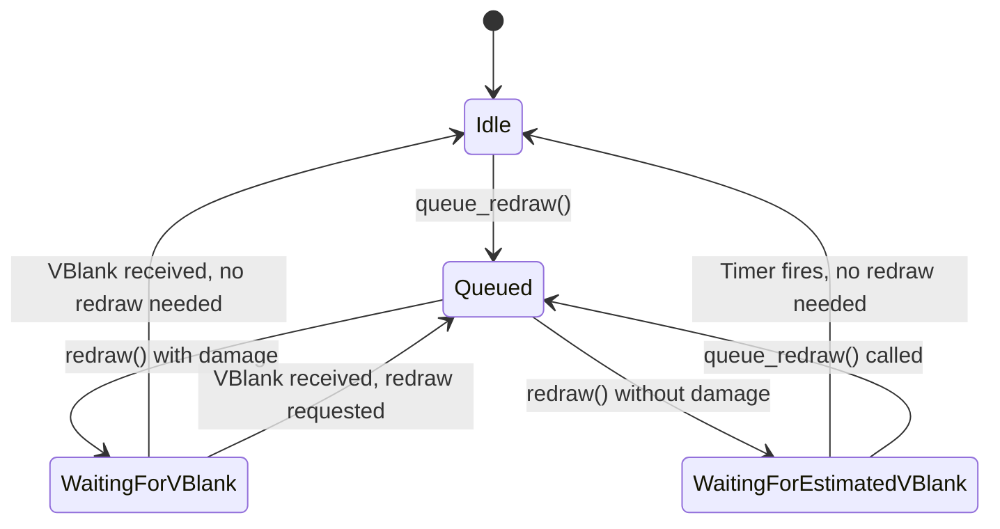

## Overview

On a TTY, only one frame can be submitted to an output at a time, and the compositor must wait until the output repaints (indicated by a VBlank) to be able to submit the next frame.

<Info>
In niri we keep track of this via the `RedrawState` enum that you can find in an `OutputState`.
</Info>

## RedrawState State Machine

Here's a diagram of state transitions for the `RedrawState` state machine:

<Frame>
  
</Frame>

## State Descriptions

### Idle State

<Card title="Idle" icon="circle">
  The default state, when the output does not need to be repainted.
  
  **Transition:** Any operation that may cause the screen to update calls `queue_redraw()`, which moves the output to a `Queued` state.
</Card>

### Queued State

<Card title="Queued" icon="list-check">
  The output is scheduled for redraw.
  
  **What happens:** At the end of an event loop dispatch, niri calls `redraw()` for every `Queued` output.
</Card>

## After Redraw

After calling `redraw()`, there are two possible paths:

<Tabs>
  <Tab title="With damage">
    If the redraw causes damage (i.e. something on the output changed):
    
    <Steps>
      <Step title="Move to WaitingForVBlank">
        We move into the `WaitingForVBlank` state, since we cannot redraw until we receive a VBlank event.
      </Step>
      
      <Step title="Wait for hardware VBlank">
        The compositor waits for the actual VBlank event from the display hardware.
      </Step>
      
      <Step title="Return to Idle or Queued">
        When VBlank arrives:
        - If nothing needs redrawing: return to `Idle`
        - If redraw was requested: move to `Queued`
      </Step>
    </Steps>
  </Tab>
  
  <Tab title="Without damage">
    If there's no damage, we do **not** return to `Idle` right away.
    
    <Steps>
      <Step title="Set estimated VBlank timer">
        We set a timer to fire roughly at when the next VBlank would occur.
      </Step>
      
      <Step title="Move to WaitingForEstimatedVBlank">
        We transition to a `WaitingForEstimatedVBlank` state.
      </Step>
      
      <Step title="Timer completion or new redraw">
        Then either:
        - The estimated VBlank timer completes → go back to `Idle`
        - We call `queue_redraw()` once more → try to redraw again
      </Step>
    </Steps>
  </Tab>
</Tabs>

## Why Estimated VBlank?

<Warning>
This is necessary in order to throttle frame callbacks sent to applications to at most once per output refresh cycle.
</Warning>

Without this throttling, applications can start continuously redrawing without damage and eating a lot of CPU in the process.

### Example Scenario

<Card title="Off-screen content changes" icon="triangle-exclamation">
  If the application window is partially off-screen, and it is only the off-screen part that changes, the compositor sees no damage on the visible area.
  
  Without estimated VBlank throttling, the application could:
  1. Render a frame
  2. Immediately receive a frame callback
  3. Render another frame
  4. Repeat indefinitely
  
  This would consume excessive CPU for no visible benefit.
</Card>

## State Flow Summary

## Key Takeaways

<AccordionGroup>
  <Accordion title="Frame submission is sequential">
    Only one frame can be submitted to an output at a time on TTY.
  </Accordion>
  
  <Accordion title="VBlank synchronization">
    The compositor must wait for VBlank before submitting the next frame with damage.
  </Accordion>
  
  <Accordion title="Frame callback throttling">
    Estimated VBlank is used to throttle frame callbacks even when there's no damage, preventing excessive CPU usage.
  </Accordion>
  
  <Accordion title="State tracking via RedrawState">
    The `RedrawState` enum in `OutputState` manages the entire redraw cycle.
  </Accordion>
</AccordionGroup>
